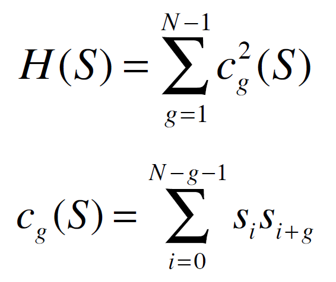

# gen_acbsp
Genetic algorithm for solving the Auto-Correlation Binary Sequence Problem.

The Low-Autocorrelation Binary Sequence (LABS) problem arises in statistical mechanics (related to what physicists call the ISING problem), and in radar and communications engineering. In this assignment you will create a GA for this problem, the goal of which is to find a sequence of +1’s and -1’s of fixed length that has the minimum possible measure H. H is calculated as follows:

Where:
- S is the binary sequence
- N is the length of the S
- si is either +1 or -1
- Subscripts are all taken modulo N.

The algorithm uses tournament selection of the size specifiable by user. User also can choose the termination criteria: either by number of generations or by evaluation limit. The algorithm has three built-in crossover mechanisms and ability to add more. Three crossover types are: one-point crossover, template-based crossover and two point crossover with two children generated and only the fittest is taken to the next population.
